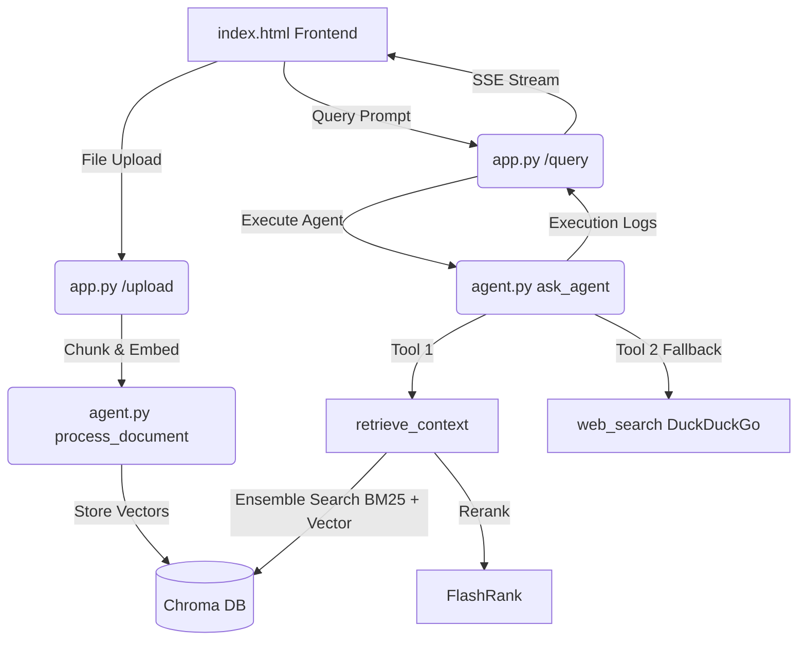

# Search Agent

A hybrid Document Search Agent built using FastAPI, LangChain, Gemini, and Chroma DB. The application utilizes local Retrieval-Augmented Generation (RAG) combined with web search fallback and features a real-time log-streaming chat interface.

---

## Features

- **Dynamic File Ingestion**: Supports PDF, DOCX, TXT, and MD files. Documents are parsed, split using a recursive character chunker, embedded using Gemini, and stored in a local Chroma vector database.
- **Hybrid Search & Reranking**: Merges sparse keyword retrieval (BM25) and dense semantic retrieval (Chroma vector search) using an Ensemble Retriever, followed by FlashRank reranking for top-context precision.
- **Agentic Fallback**: Uses a LangChain tool-calling agent with access to document retrieval and DuckDuckGo web search. The agent prioritizes local documents first and dynamically falls back to web search if the information is missing or needs real-time validation.
- **Real-Time Log Streaming**: Streams agent execution thoughts and tool logs to the frontend in real-time using Server-Sent Events (SSE) and custom LangChain callback handlers.
- **Interactive UI**: Features a collapsible sidebar, document listing with single-file deletion, clear vector store controls, and a dark-theme minimalist layout with custom scrollbars.

---

## Project Structure

```text
├── .devcontainer/         # Dev container environment settings
├── .env                  # Local environment configuration (ignored by git)
├── .gitignore            # Git ignore file
├── agent.py              # Core RAG logic, tool definitions, and LangChain agent
├── app.py                # FastAPI server, SSE generator, and REST API endpoints
├── index.html            # Single-page frontend application
├── requirements.txt      # Python dependencies
└── test_server.py        # Integration test suite
```

---

## Project Flow



1. **Ingestion Flow**:
   - The user uploads a file through the drag-and-drop zone.
   - The backend chunker splits the text, embeds it with `models/gemini-embedding-001`, and stores it in the local `chroma_db` collection.
2. **Execution & Retrieval Flow**:
   - The user inputs a query.
   - The FastAPI backend starts the LangChain agent.
   - The agent invokes `retrieve_context` to retrieve top chunks using a 50/50 combination of BM25 and Chroma vector search, reranked by FlashRank.
   - If the answer is not found in the documents, the agent triggers `web_search` to query DuckDuckGo.
3. **Streaming Flow**:
   - Every agent step (LLM start/end, tool start/end) is captured by a custom callback handler and pushed to an SSE generator.
   - The frontend reads the stream and renders the step-by-step logs inside a collapsible "Thinking..." box.

---

## AI Technology Stack

- **Large Language Model (LLM)**: Gemini 2.5 Flash (`gemini-2.5-flash`) via Google GenAI.
- **Embeddings Model**: Gemini Embedding 001 (`models/gemini-embedding-001`).
- **Orchestration**: LangChain (LangChain Core, LangChain Community, and langchain-google-genai).
- **Vector Database**: Chroma DB.
- **Reranker**: FlashRank.
- **Search Engine**: DuckDuckGo.

---

## Setup Guide

### Prerequisites

- Python 3.10+ (tested on Python 3.12)
- Gemini API Key

### Installation

1. Clone the repository:
   ```bash
   git clone <repository_url>
   cd SearchAgent
   ```

2. Create and activate a virtual environment:
   ```bash
   python -m venv venv
   # On Windows (cmd):
   venv\Scripts\activate
   # On Windows (PowerShell):
   .\venv\Scripts\Activate.ps1
   # On macOS/Linux:
   source venv/bin/activate
   ```

3. Install the dependencies:
   ```bash
   pip install -r requirements.txt
   ```

4. Create a `.env` file in the root directory:
   ```env
   export GOOGLE_API_KEY=your_gemini_api_key_here
   ```

### Running the Project

1. Run the FastAPI server:
   ```bash
   python app.py
   ```
   The backend will start on `http://127.0.0.1:8501`.

2. Serve the frontend:
   - You can open `http://127.0.0.1:8501/` directly in your browser.
   - Alternatively, serve the static frontend using a web server of your choice:
     ```bash
     npx serve index.html
     ```

### Running the Integration Tests

To run the automated endpoint verification suite:
```bash
python test_server.py
```
This tests document listing, ingestion, query log-streaming, and deletion.
